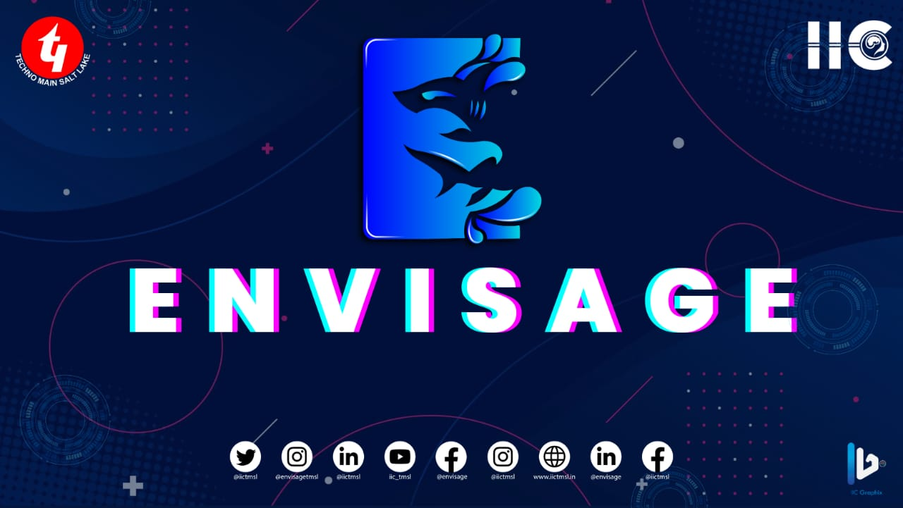

# Envisage 2k24 Website



> The repo for the official website of Envisage 2k24.

## Features

- Image Gallery
- Mobile Responsive Nav
- Lazy Loading Images

## Tech Stack

- [Next.JS](https://nextjs.org/) - The React Framework for the Web
- [Tailwind CSS](https://tailwindcss.com/) - Rapidly build modern websites without ever leaving your HTML.
- [Headless UI](https://headlessui.com/) - Unstyled, fully accessible UI components.
- [`framer-motion`](https://www.framer.com/motion/) - Production-ready declarative animations.
- [`lightbox.js-react`](https://www.getlightboxjs.com/) - The all-in-one React lightbox.

## Development

1. To install the needed dependencies run

   ```bash
   yarn install
   ```

2. To spin up dev server run

   ```bash
   yarn dev
   ```

3. To build this project run

   ```bash
   yarn build
   ```

## Authors


- Subhadeep Roy - [@subhadeep3902](https://www.github.com/subhadeep3902)
- Utsav Tiwari -[@utsav306](https://github.com/utsav306)
- Harshankit Raj -[@Harsh-2410](https://github.com/Harsh-2410)    
- Atul Kumar Singh - [@RudraSingh](https://github.com/RudrasSingh)


  
  

##Updates Made By
-Kumar Aditya -[@kumarAditya18027](https://www.github.com/kumaraditya18027)
## License

[MIT](LICENSE)
